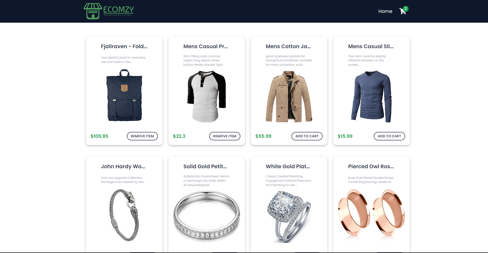
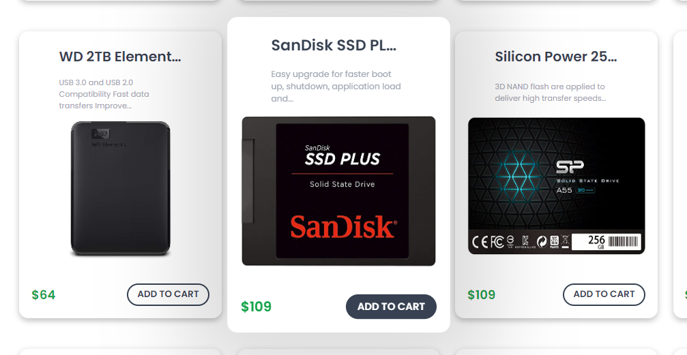
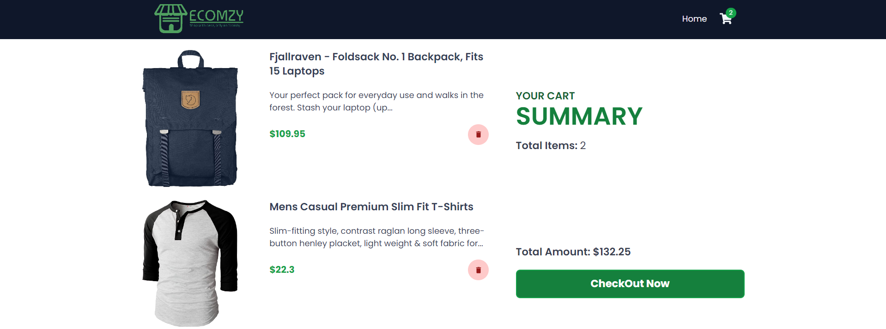
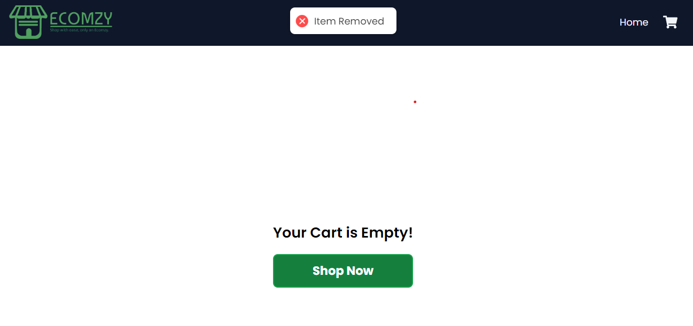

# Ecomzy - E-commerce Shopping Cart

Ecomzy is an e-commerce shopping cart website that allows users to browse a selection of items, add or remove items from their cart, view the cart's contents, and proceed to checkout. This README provides an overview of the project and its functionality.






## Table of Contents

- [Overview](#overview)
- [Installation](#installation)
- [Usage](#usage)
- [Features](#features)
- [Technologies Used](#technologies-used)
- [Contributing](#contributing)
- [License](#license)

## Overview

Ecomzy is designed to provide a user-friendly and interactive shopping experience. The project includes two main pages:

1. **Home Page:** Displays a grid of items available for purchase. Each item is presented with its name, description, price, and options to add or remove it from the shopping cart.

2. **Cart Page:** Shows the items added to the cart, the total price of all items, and provides the option to delete items from the cart. Users can proceed to checkout from this page.

## Installation

1. Clone the repository:

   ```bash
   git clone https://github.com/sargunkohli152/Ecomzy_Shopping_Cart.git

2. Open the project in your code editor and install dependencies

   ```bash
   npm install

3. Run the development server
   ```bash
   npm run start

## Usage
 - **Home Page:** Browse the list of items, read their descriptions, and add or remove items from your shopping cart.
 - **Cart Page:** View the items in your shopping cart, calculate the total price, delete unwanted items, and proceed to checkout.

## Features
 - User-friendly interface for item selection and cart management.
 - Ability to add or remove items from the cart.
 - Detailed information (name, description, price) for each item.
 - Cart summary displaying the total price.
 - Cart item deletion option.
 - Checkout button to proceed with the purchase.

## Technologies Used
 - Tailwind CSS
 - ReactJS

## Contributing
Contributions are welcome! If you have any suggestions, improvements, or want to add new features to enhance the shopping cart experience, please fork the project, make your changes, and submit a pull request.

## License
MIT License

Permission is hereby granted, free of charge, to any person obtaining a copy of this software and associated documentation files (the "Software"), to deal in the Software without restriction, including without limitation the rights to use, copy, modify, merge, publish, distribute, sublicense, and/or sell copies of the Software, and to permit persons to whom the Software is furnished to do so, subject to the following conditions:

The above copyright notice and this permission notice shall be included in all copies or substantial portions of the Software.

THE SOFTWARE IS PROVIDED "AS IS", WITHOUT WARRANTY OF ANY KIND, EXPRESS OR IMPLIED, INCLUDING BUT NOT LIMITED TO THE WARRANTIES OF MERCHANTABILITY, FITNESS FOR A PARTICULAR PURPOSE AND NONINFRINGEMENT. IN NO EVENT SHALL THE AUTHORS OR COPYRIGHT HOLDERS BE LIABLE FOR ANY CLAIM, DAMAGES OR OTHER LIABILITY, WHETHER IN AN ACTION OF CONTRACT, TORT OR OTHERWISE, ARISING FROM, OUT OF OR IN CONNECTION WITH THE SOFTWARE OR THE USE OR OTHER DEALINGS IN THE SOFTWARE.
